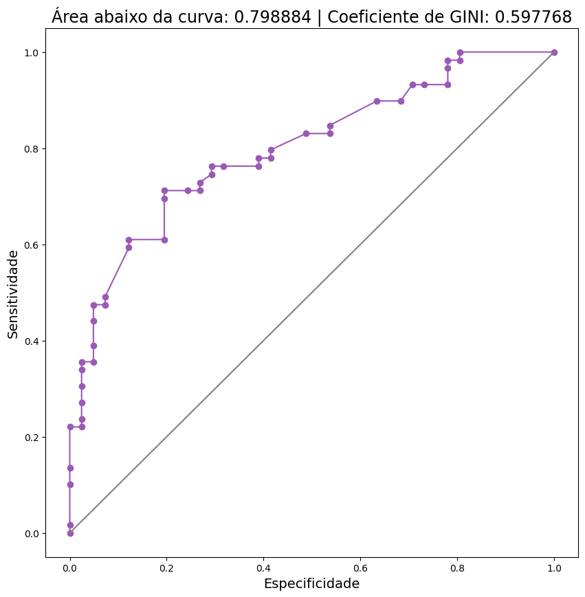

# Modelos Logisticos Binarios e Multinomiais
É uma distribuição de probabilidade de ocorrência de determinado evento (Binominal) ou eventos(Multinomiais).Também conhecida como Distribuição de Bernoulli.
Ambos modelos utilizam a função de máxima verossimilhança, O método busca valores para os parâmetros de maneira a maximizar a probabilidade dos dados amostrados, dado o modelo assumido (no caso, distribuição normal).
# Regressão Binária
É uma distribuição de probabilidade de ocorrência de determinado evento (Binominal).
Os valores podem estar entre Não-Evento(0) e Evento(1).
## Importando bibliotecas e dados


```python
import pandas as pd                     # manipulação de dado em formato de dataframe
import seaborn as sns                   # biblioteca de visualização de informações estatísticas
import matplotlib.pyplot as plt         # biblioteca de visualização de dados
import statsmodels.api as sm            # biblioteca de modelagem estatística
import numpy as np                      # biblioteca para operações matemáticas multidimensionais
import statsmodels.formula.api as smf   # biblioteca para modelagem glm
import scipy.stats as st
import tabulate
from scipy import stats
from statsmodels.iolib.summary2 import summary_col
from sklearn.metrics import confusion_matrix, accuracy_score, ConfusionMatrixDisplay, recall_score,roc_curve,auc
from statsmodels.discrete.discrete_model import MNLogit   


dados = pd.read_csv("atrasado.csv")
```

## Análise Exploratória

#### Visualizar os Dados


```python
tab = dados.head()
print(tab.to_markdown())
```

    |    | estudante   |   atrasado |   dist |   sem |
    |---:|:------------|-----------:|-------:|------:|
    |  0 | Gabriela    |          0 |   12.5 |     7 |
    |  1 | Patricia    |          0 |   13.3 |    10 |
    |  2 | Gustavo     |          0 |   13.4 |     8 |
    |  3 | Leticia     |          0 |   23.5 |     7 |
    |  4 | Luiz Ovidio |          0 |    9.5 |     8 |
    
A base dados conta com observações de alunos que chegaram atrasados a aula, informando a distância(km) percorrida e a quantidade de semáforos pegos durante o trajeto.
#### Características das variáveis


```python
dados.info()
```

    <class 'pandas.core.frame.DataFrame'>
    RangeIndex: 100 entries, 0 to 99
    Data columns (total 4 columns):
     #   Column     Non-Null Count  Dtype  
    ---  ------     --------------  -----  
     0   estudante  100 non-null    object 
     1   atrasado   100 non-null    int64  
     2   dist       100 non-null    float64
     3   sem        100 non-null    int64  
    dtypes: float64(1), int64(2), object(1)
    memory usage: 3.2+ KB
    

#### Estatísticas univariadas


```python
tab = dados.describe()
print(tab.to_markdown())
```

    |       |   atrasado |      dist |       sem |
    |:------|-----------:|----------:|----------:|
    | count | 100        | 100       | 100       |
    | mean  |   0.59     |  14.073   |  10.21    |
    | std   |   0.494311 |   4.33011 |   1.57823 |
    | min   |   0        |   1       |   5       |
    | 25%   |   0        |  12       |  10       |
    | 50%   |   1        |  13.35    |  10       |
    | 75%   |   1        |  16.125   |  10       |
    | max   |   1        |  29       |  18       |
    

#### Contagem dos Valores


```python
print('0 = não atrasado')
print('1 = atrasado')
dados['atrasado'].value_counts() 
```

    0 = não atrasado
    1 = atrasado
    


    atrasado
    1    59
    0    41
    Name: count, dtype: int64


## Estimação de um modelo logístico binário


```python
modelo = smf.glm(formula = 'atrasado ~ dist + sem', 
                                        data=dados,
                                        family= sm.families.Binomial()).fit()
                 
```

### Parâmetros do modelo


```python
modelo.summary()
```


<table class="simpletable">
<caption>Generalized Linear Model Regression Results</caption>
<tr>
  <th>Dep. Variable:</th>       <td>atrasado</td>     <th>  No. Observations:  </th>  <td>   100</td> 
</tr>
<tr>
  <th>Model:</th>                  <td>GLM</td>       <th>  Df Residuals:      </th>  <td>    97</td> 
</tr>
<tr>
  <th>Model Family:</th>        <td>Binomial</td>     <th>  Df Model:          </th>  <td>     2</td> 
</tr>
<tr>
  <th>Link Function:</th>         <td>Logit</td>      <th>  Scale:             </th> <td>  1.0000</td>
</tr>
<tr>
  <th>Method:</th>                <td>IRLS</td>       <th>  Log-Likelihood:    </th> <td> -50.466</td>
</tr>
<tr>
  <th>Date:</th>            <td>Tue, 09 Apr 2024</td> <th>  Deviance:          </th> <td>  100.93</td>
</tr>
<tr>
  <th>Time:</th>                <td>14:23:36</td>     <th>  Pearson chi2:      </th>  <td>  86.7</td> 
</tr>
<tr>
  <th>No. Iterations:</th>          <td>7</td>        <th>  Pseudo R-squ. (CS):</th>  <td>0.2913</td> 
</tr>
<tr>
  <th>Covariance Type:</th>     <td>nonrobust</td>    <th>                     </th>     <td> </td>   
</tr>
</table>
<table class="simpletable">
<tr>
      <td></td>         <th>coef</th>     <th>std err</th>      <th>z</th>      <th>P>|z|</th>  <th>[0.025</th>    <th>0.975]</th>  
</tr>
<tr>
  <th>Intercept</th> <td>  -26.1665</td> <td>    8.442</td> <td>   -3.100</td> <td> 0.002</td> <td>  -42.712</td> <td>   -9.621</td>
</tr>
<tr>
  <th>dist</th>      <td>    0.1904</td> <td>    0.076</td> <td>    2.493</td> <td> 0.013</td> <td>    0.041</td> <td>    0.340</td>
</tr>
<tr>
  <th>sem</th>       <td>    2.3629</td> <td>    0.795</td> <td>    2.972</td> <td> 0.003</td> <td>    0.804</td> <td>    3.921</td>
</tr>
</table>


As informações geradas pelo modelo, que servem  de métricas para analisar os paramêtros e a eficiência global do modelo.
As mais relevantes para analisar o modelo são o P-valor de cada variável pretidora, e Log-Likelihood do modelo.
O P-valor (P>|Z|) obtido para cada variável ficou abaixo do de 0.05 ou 5%, isto mostra que os dois Betas são estatisticamente significantes para a contrusção do modelo.
O Log-Liklihood quanto mais alto melhor, ele é um parâmetro de comparação entre dois modelos.
O Qui-quadrado(Pearson Chi2) mostra a correlação entre as variáveis.
### Adicionando as predições inteiras e seus percentuais de probabilidade na base de dados


```python
dados['resultado'] = modelo.predict()
dados['resultado(%)'] = modelo.predict()*100
tab = dados.head()
print(tab.to_markdown())
```

    |    | estudante   |   atrasado |   dist |   sem |   resultado |   resultado(%) |
    |---:|:------------|-----------:|-------:|------:|------------:|---------------:|
    |  0 | Gabriela    |          0 |   12.5 |     7 |  0.00071202 |       0.071202 |
    |  1 | Patricia    |          0 |   13.3 |    10 |  0.498561   |      49.8561   |
    |  2 | Gustavo     |          0 |   13.4 |     8 |  0.00890254 |       0.890254 |
    |  3 | Leticia     |          0 |   23.5 |     7 |  0.00575127 |       0.575127 |
    |  4 | Luiz Ovidio |          0 |    9.5 |     8 |  0.00425694 |       0.425694 |
    
Agora cada observação conta com a presença da coluna de resultado, que foi predito utilizando o modelo desenvovlido.
Assim pode se ver a probabilidade de ocorrência para cada observação.
## Métricas para análise do modelo
Ao realizar uma Regressão Binária, é fundamental determinar um valor de cutt-off que irá considerar uma faixa para as probabilidades preditas serem eventos ou não-eventos. 
Os valores podem assumir números entre 0 e 1.
#### Construção de Função para matriz de confusão para determinado Cutoff


```python
def matriz_confusao(observado,predicts,cutoff):
    
    values = predicts.values
    
    predicao_binaria = []
    
    for item in values:
        if item >= cutoff:
            predicao_binaria.append(1)
        else:
            predicao_binaria.append(0)
    
    cm = confusion_matrix(observado, predicao_binaria)
    disp = ConfusionMatrixDisplay(confusion_matrix=cm)
    disp.plot()
    plt.show()
    
    sensitividade = recall_score(observado, predicao_binaria, pos_label=1)
    especificidadee = recall_score(observado, predicao_binaria, pos_label=0)
    acuracia = accuracy_score(observado, predicao_binaria)

    #Visualizando os principais indicadores desta matriz de confusão
    indicadores = pd.DataFrame({'Sensitividade':[sensitividade],
                                'Especificidade':[especificidadee],
                                'Acurácia':[acuracia]})
    indicadores = indicadores.to_markdown()
    return indicadores
```

#### Rodando Função de matriz de Confusão para Cuttof = 0.5


```python
matriz_confusao(observado=dados['atrasado'],
                predicts=dados['resultado'], 
                cutoff=0.5)
```


    

    


    '|    |   Sensitividade |   Especificidade |   Acurácia |\n|---:|----------------:|-----------------:|-----------:|\n|  0 |        0.779661 |         0.609756 |       0.71 |'


Ao escolher o cut-off de 0.5, estamos considerando que as predições com valores maiores do que 0.5 (50% de probabilidade) serão considerados eventos, e as probabilidades menores do que esse cut-off será não-evento.
Então é calculada uma matriz de confusão para comparar as predições com os resultados reias.
A taxa de acerto dos eventos é chamada de sensitividade - foram acertos 46 de 62 possíveis não-eventos, 77%
A taxa de acerto dos não-eventos é chamada de especifidade - foram acertos 25 de 38 possíveis não-eventos, 60%
A acurácia mostra a taxa global de acertos do modelo para esse cut-off - Foram acertos no total 71/100 observações, 71% 
### Função para testar cutoffs entre 0,1 até 1.01


```python
def espec_sens(observado,predicts):
    
    # adicionar objeto com os valores dos predicts
    values = predicts.values
    
    # range dos cutoffs a serem analisados em steps de 0.01
    cutoffs = np.arange(0,1.01,0.01)
    
    # Listas que receberão os resultados de especificidade e sensitividade
    lista_sensitividade = []
    lista_especificidade = []
    
    for cutoff in cutoffs:
        
        predicao_binaria = []
        
        # Definindo resultado binário de acordo com o predict
        for item in values:
            if item >= cutoff:
                predicao_binaria.append(1)
            else:
                predicao_binaria.append(0)
                
        # Cálculo da sensitividade e especificidade no cutoff
        sensitividade = recall_score(observado, predicao_binaria, pos_label=1)
        especificidadee = recall_score(observado, predicao_binaria, pos_label=0)
        
        # Adicionar valores nas listas
        lista_sensitividade.append(sensitividade)
        lista_especificidade.append(especificidadee)
        
    # Criar dataframe com os resultados nos seus respectivos cutoffs
    resultado = pd.DataFrame({'cutoffs':cutoffs,'sensitividade':lista_sensitividade,'especificidade':lista_especificidade})
    return resultado
```

### Rodando Função nos Dados 


```python
dados_plotagem = espec_sens(observado = dados['atrasado'],
                            predicts = dados['resultado'])
tab = dados_plotagem.head()
print(tab.to_markdown())

```

    |    |   cutoffs |   sensitividade |   especificidade |
    |---:|----------:|----------------:|-----------------:|
    |  0 |      0    |               1 |         0        |
    |  1 |      0.01 |               1 |         0.170732 |
    |  2 |      0.02 |               1 |         0.170732 |
    |  3 |      0.03 |               1 |         0.170732 |
    |  4 |      0.04 |               1 |         0.170732 |
    

### Plotando Gráfico Sensitividade/Especificidade em função do Cuttof


```python
plt.figure(figsize=(10,10))
plt.plot(dados_plotagem.cutoffs,dados_plotagem.sensitividade, '-o',
         color="#440154FF")
plt.plot(dados_plotagem.cutoffs,dados_plotagem.especificidade, '-o',
         color="#2ecc71")
plt.legend(['Sensitividade', 'Especificidade'], fontsize=17)
plt.xlabel("Cuttoff", fontsize=14)
plt.ylabel("Sensitividade / Especificidade", fontsize=14)
plt.show()
```


    

    

Esse grafico mostra as taxas de especifidade/ sensitividade variando em função do cutt-off.
### Plotagem Curva ROC


```python
fpr, tpr, thresholds = roc_curve(dados['atrasado'],dados['resultado'])
roc_auc = auc(fpr, tpr)

#Cálculo do coeficiente de GINI
gini = (roc_auc - 0.5)/(0.5)

#Plotando a curva ROC
plt.figure(figsize=(10,10))
plt.plot(fpr,tpr, '-o', color="#9b59b6")
plt.plot(fpr,fpr, color='gray')
plt.title("Área abaixo da curva: %f" % roc_auc +
          " | Coeficiente de GINI: %f" % gini, fontsize=17)
plt.xlabel("Especificidade", fontsize=14)
plt.ylabel("Sensitividade", fontsize=14)
plt.show()
```


    

    


A curva roc é um dos parâmetros que mais informa a qualidade global do modelo.
a curva roc é uma curva da especifidade em função da sensitividade, criando uma área de acerto que mostra demonstra a eficiência do modelo.
Quanto maior a área, melhor o ajuste do modelo.

# Regressão Multinomial
É uma distribuição de probabilidade de ocorrência de multiplos eventos.
Os valores podem estar entre referência(0), Evento-1(1), Evento-2(2), Evento-x(x).
É calculado a probabilidade de ocorrência de cada evento possível para determinada observação.
## Importando bibliotecas e dados


```python
import pandas as pd                     # manipulação de dado em formato de dataframe
import seaborn as sns                   # biblioteca de visualização de informações estatísticas
import matplotlib.pyplot as plt         # biblioteca de visualização de dados
import statsmodels.api as sm            # biblioteca de modelagem estatística
import numpy as np                      # biblioteca para operações matemáticas multidimensionais
import statsmodels.formula.api as smf   # biblioteca para modelagem glm
import scipy.stats as st
import tabulate
from statsmodels.iolib.summary2 import summary_col
from sklearn.metrics import confusion_matrix, accuracy_score, ConfusionMatrixDisplay, recall_score,roc_curve,auc
from statsmodels.discrete.discrete_model import MNLogit   


dados_multinomial = pd.read_csv("atrasado_multinomial.csv",
                   delimiter = ',')
```

## Análise Exploratória

### Visualização dos dados


```python
tab = dados_multinomial.head()
print(tab.to_markdown())
```

    |    | estudante   | atrasado                     |   dist |   sem |
    |---:|:------------|:-----------------------------|-------:|------:|
    |  0 | Gabriela    | chegou atrasado segunda aula |   20.5 |    15 |
    |  1 | Patricia    | chegou atrasado segunda aula |   21.3 |    18 |
    |  2 | Gustavo     | chegou atrasado segunda aula |   21.4 |    16 |
    |  3 | Leticia     | chegou atrasado segunda aula |   31.5 |    15 |
    |  4 | Luiz Ovidio | chegou atrasado segunda aula |   17.5 |    16 |
    
A base dados conta com observações de alunos que chegaram atrasados para primeira aula, ou atrasados para segunda aula ou os que não chegaram atrasados, informando a distância(km) percorrida e a quantidade de semáforos pegos durante o trajeto.
### Características das variáveis


```python
dados_multinomial.info()
```

    <class 'pandas.core.frame.DataFrame'>
    RangeIndex: 100 entries, 0 to 99
    Data columns (total 4 columns):
     #   Column     Non-Null Count  Dtype  
    ---  ------     --------------  -----  
     0   estudante  100 non-null    object 
     1   atrasado   100 non-null    object 
     2   dist       100 non-null    float64
     3   sem        100 non-null    int64  
    dtypes: float64(1), int64(1), object(2)
    memory usage: 3.2+ KB
    

### Estatísticas das variáveis


```python

tab = dados_multinomial.describe()
print(tab.to_markdown())
```

    |       |     dist |       sem |
    |:------|---------:|----------:|
    | count | 100      | 100       |
    | mean  |  17.673  |  13.81    |
    | std   |   5.1303 |   3.32938 |
    | min   |   1      |  10       |
    | 25%   |  14.95   |  10       |
    | 50%   |  18.75   |  15       |
    | 75%   |  21      |  18       |
    | max   |  31.5    |  19       |
    

### Contagem dos valores


```python
dados_multinomial['atrasado'].value_counts(sort=False)
```


    atrasado
    chegou atrasado segunda aula     35
    chegou atrasado primeira aula    16
    nao chegou atrasado              49
    Name: count, dtype: int64


## Estimação do Modelo

### Criando Categorias de Referencia 


```python
dados_multinomial.loc[dados_multinomial['atrasado']==
                            'nao chegou atrasado',
                            'atrasado2'] = 0 #categoria de referência
dados_multinomial.loc[dados_multinomial['atrasado']==
                            'chegou atrasado primeira aula',
                            'atrasado2'] = 1
dados_multinomial.loc[dados_multinomial['atrasado']==
                            'chegou atrasado segunda aula',
                            'atrasado2'] = 2
```
É necessário definir um evento como referência antes de estimar o modelo.
E também criar valores para cada evento possivel, assim será possivel estimar o modelo corretamente.
Foi definido que
nao chegou atrasado = 0
chegou atrasado primeira aula = 1
chegou atrasado segunda aula = 2

```python
tab = dados_multinomial.head()
print(tab.to_markdown())
```

    |    | estudante   | atrasado                     |   dist |   sem |   atrasado2 |
    |---:|:------------|:-----------------------------|-------:|------:|------------:|
    |  0 | Gabriela    | chegou atrasado segunda aula |   20.5 |    15 |           2 |
    |  1 | Patricia    | chegou atrasado segunda aula |   21.3 |    18 |           2 |
    |  2 | Gustavo     | chegou atrasado segunda aula |   21.4 |    16 |           2 |
    |  3 | Leticia     | chegou atrasado segunda aula |   31.5 |    15 |           2 |
    |  4 | Luiz Ovidio | chegou atrasado segunda aula |   17.5 |    16 |           2 |
    

### Estimação do Modelo


```python
x = dados_multinomial.drop(columns=['estudante','atrasado','atrasado2'])
y = dados_multinomial['atrasado2']
X = sm.add_constant(x)
modelo_atrasado = MNLogit(endog=y, exog=X).fit()
```

    Optimization terminated successfully.
             Current function value: 0.245118
             Iterations 10
    
Estimação do modelo
Atrasado2 ~ Distancia e Semaforos
### Parâmetros do modelo


```python
modelo_atrasado.summary()
```


<table class="simpletable">
<caption>MNLogit Regression Results</caption>
<tr>
  <th>Dep. Variable:</th>       <td>atrasado2</td>    <th>  No. Observations:  </th>  <td>   100</td>  
</tr>
<tr>
  <th>Model:</th>                <td>MNLogit</td>     <th>  Df Residuals:      </th>  <td>    94</td>  
</tr>
<tr>
  <th>Method:</th>                 <td>MLE</td>       <th>  Df Model:          </th>  <td>     4</td>  
</tr>
<tr>
  <th>Date:</th>            <td>Tue, 09 Apr 2024</td> <th>  Pseudo R-squ.:     </th>  <td>0.7574</td>  
</tr>
<tr>
  <th>Time:</th>                <td>15:34:17</td>     <th>  Log-Likelihood:    </th> <td> -24.512</td> 
</tr>
<tr>
  <th>converged:</th>             <td>True</td>       <th>  LL-Null:           </th> <td> -101.02</td> 
</tr>
<tr>
  <th>Covariance Type:</th>     <td>nonrobust</td>    <th>  LLR p-value:       </th> <td>4.598e-32</td>
</tr>
</table>
<table class="simpletable">
<tr>
  <th>atrasado2=1</th>    <th>coef</th>     <th>std err</th>      <th>z</th>      <th>P>|z|</th>  <th>[0.025</th>    <th>0.975]</th>  
</tr>
<tr>
  <th>const</th>       <td>  -33.1352</td> <td>   12.183</td> <td>   -2.720</td> <td> 0.007</td> <td>  -57.014</td> <td>   -9.256</td>
</tr>
<tr>
  <th>dist</th>        <td>    0.5588</td> <td>    0.243</td> <td>    2.297</td> <td> 0.022</td> <td>    0.082</td> <td>    1.036</td>
</tr>
<tr>
  <th>sem</th>         <td>    1.6699</td> <td>    0.577</td> <td>    2.895</td> <td> 0.004</td> <td>    0.539</td> <td>    2.801</td>
</tr>
<tr>
  <th>atrasado2=2</th>    <th>coef</th>     <th>std err</th>      <th>z</th>      <th>P>|z|</th>  <th>[0.025</th>    <th>0.975]</th>  
</tr>
<tr>
  <th>const</th>       <td>  -62.2922</td> <td>   14.675</td> <td>   -4.245</td> <td> 0.000</td> <td>  -91.055</td> <td>  -33.530</td>
</tr>
<tr>
  <th>dist</th>        <td>    1.0784</td> <td>    0.302</td> <td>    3.566</td> <td> 0.000</td> <td>    0.486</td> <td>    1.671</td>
</tr>
<tr>
  <th>sem</th>         <td>    2.8949</td> <td>    0.686</td> <td>    4.220</td> <td> 0.000</td> <td>    1.550</td> <td>    4.239</td>
</tr>
</table>


Podemos interpertrar da mesma forma que o modelo binário. Só que agora temos duas equações para se analisar, ja que temos 2 possiveis eventos.
As mais relevantes para analisar o modelo são o P-valor de cada variável pretidora, e Log-Likelihood do modelo
Equação para o evento 1 e equação para evento 2.

### Qui²


```python
def Qui2(modelo_multinomial):
    maximo = modelo_multinomial.llf
    minimo = modelo_multinomial.llnull
    qui2 = -2*(minimo - maximo)
    pvalue = stats.distributions.chi2.sf(qui2,1)
    df = pd.DataFrame({'Qui quadrado':[qui2],
                       'pvalue':[pvalue]})
    return df
Qui2(modelo_atrasado)
```


<div>
<style scoped>
    .dataframe tbody tr th:only-of-type {
        vertical-align: middle;
    }

    .dataframe tbody tr th {
        vertical-align: top;
    }

    .dataframe thead th {
        text-align: right;
    }
</style>
<table border="1" class="dataframe">
  <thead>
    <tr style="text-align: right;">
      <th></th>
      <th>Qui quadrado</th>
      <th>pvalue</th>
    </tr>
  </thead>
  <tbody>
    <tr>
      <th>0</th>
      <td>153.014842</td>
      <td>3.802150e-35</td>
    </tr>
  </tbody>
</table>
</div>


## Predições

### Realizando Predição e adicionando ao banco de dados (Probabilidades)


```python
resultado = modelo_atrasado.predict()
resultado = pd.DataFrame(resultado)
dados_multinomial = pd.concat([dados_multinomial, resultado], axis=1)
```

### Adicionando maior probabilidade da predição


```python
classificacao = resultado.idxmax(axis=1)
dados_multinomial['predicao'] = classificacao
tab = dados_multinomial.head()
print(tab.to_markdown())
```

    |    | estudante   | atrasado                     |   dist |   sem |   atrasado2 |           0 |          1 |        2 |   predicao |
    |---:|:------------|:-----------------------------|-------:|------:|------------:|------------:|-----------:|---------:|-----------:|
    |  0 | Gabriela    | chegou atrasado segunda aula |   20.5 |    15 |           2 | 0.0180102   | 0.523388   | 0.458602 |          1 |
    |  1 | Patricia    | chegou atrasado segunda aula |   21.3 |    18 |           2 | 2.7513e-06  | 0.0187368  | 0.98126  |          2 |
    |  2 | Gustavo     | chegou atrasado segunda aula |   21.4 |    16 |           2 | 0.000679619 | 0.173472   | 0.825849 |          2 |
    |  3 | Leticia     | chegou atrasado segunda aula |   31.5 |    15 |           2 | 2.75948e-07 | 0.00374792 | 0.996252 |          2 |
    |  4 | Luiz Ovidio | chegou atrasado segunda aula |   17.5 |    16 |           2 | 0.0208378   | 0.601588   | 0.377574 |          1 |
    

Agora cada observação conta com a presença das colunas 0,1 e 2, que mostram a probabilidade para cada evento.
E também com a coluna 'predição' que mostra o evento com maior probabilidade de ocorrência.

### Criando Variavel "Predição" que rotula o evento com maior probabilidade


```python
dados_multinomial.loc[dados_multinomial['predicao']==0,
                            'predicao_label'] ='nao chegou atrasado'
dados_multinomial.loc[dados_multinomial['predicao']==1,
                            'predicao_label'] ='chegou atrasado primeira aula'
dados_multinomial.loc[dados_multinomial['predicao']==2,
                            'predicao_label'] ='chegou atrasado segunda aula'


```

### Visualizando Predições Rotuladas


```python
tab = dados_multinomial.head()
print(tab.to_markdown())
```

    |    | estudante   | atrasado                     |   dist |   sem |   atrasado2 |           0 |          1 |        2 |   predicao | predicao_label                |
    |---:|:------------|:-----------------------------|-------:|------:|------------:|------------:|-----------:|---------:|-----------:|:------------------------------|
    |  0 | Gabriela    | chegou atrasado segunda aula |   20.5 |    15 |           2 | 0.0180102   | 0.523388   | 0.458602 |          1 | chegou atrasado primeira aula |
    |  1 | Patricia    | chegou atrasado segunda aula |   21.3 |    18 |           2 | 2.7513e-06  | 0.0187368  | 0.98126  |          2 | chegou atrasado segunda aula  |
    |  2 | Gustavo     | chegou atrasado segunda aula |   21.4 |    16 |           2 | 0.000679619 | 0.173472   | 0.825849 |          2 | chegou atrasado segunda aula  |
    |  3 | Leticia     | chegou atrasado segunda aula |   31.5 |    15 |           2 | 2.75948e-07 | 0.00374792 | 0.996252 |          2 | chegou atrasado segunda aula  |
    |  4 | Luiz Ovidio | chegou atrasado segunda aula |   17.5 |    16 |           2 | 0.0208378   | 0.601588   | 0.377574 |          1 | chegou atrasado primeira aula |
    

## Métricas de Análise Do Modelo

### Matriz de Confusão


```python
labels = ['não chegou atrasado',
          'chegou atrasado na primeira aula',
          'chegou atrasado na segunda aula']

matrix = confusion_matrix(dados_multinomial['atrasado'],
                          dados_multinomial['predicao_label'])

tab=pd.DataFrame(matrix, 
             index= labels, 
             columns = labels)
print(tab.to_markdown())
```

    |                                  |   não chegou atrasado |   chegou atrasado na primeira aula |   chegou atrasado na segunda aula |
    |:---------------------------------|----------------------:|-----------------------------------:|----------------------------------:|
    | não chegou atrasado              |                    12 |                                  3 |                                 1 |
    | chegou atrasado na primeira aula |                     5 |                                 30 |                                 0 |
    | chegou atrasado na segunda aula  |                     2 |                                  0 |                                47 |
    
A matriz de confusão mostra a taxa de acerto para cada evento. Não existe a presença de especifidade, sensitivdade para regressões multinomiais.
Não chegou atrasado - taxa de acerto 12/16 eventos.
chegou atrasado na primeira aula - taxa de acerto 30/35 eventos.
chegou atrasado na segunda aula - taxa de acerto 47/49 eventos.
### Acurácia Global


```python
table = pd.pivot_table(dados_multinomial,
                       index=['predicao_label'],
                       columns=['atrasado'],
                       aggfunc='size')
table = table.fillna(0)
table = table.to_numpy()
acuracia = table.diagonal().sum()/table.sum()
acuracia
```


    0.89


O modelo apresentou uma acurácia global de 89%, 89/100 acertos.